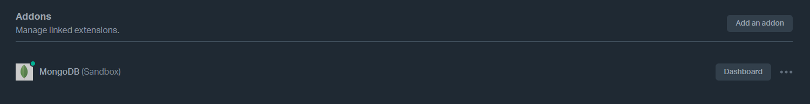

# Scalingo Todo App

It's an app deployed by scalingo that is linked to a Github repository

# Link Github for deployment

You have to link Github repo for automatic or manual deployment and also you have to specify the branch.

# Addon for MongoDB

You have to install addon for mongodb connection

# Environments

When you install mongodb addon, immediately you get environments for mongodb connection

# Manual deployment

Now you have to trigger deployment manually in my case

# Overview

Here is the overview of the Scalingo app deployed

# Successful Deployment

Here is the result of the deployment

And here is the app available at https://mytodoapp.osc-fr1.scalingo.io/

You can add as many tasks as you want and also delete them

In addition, you can check logs to see the operations performed in the app

